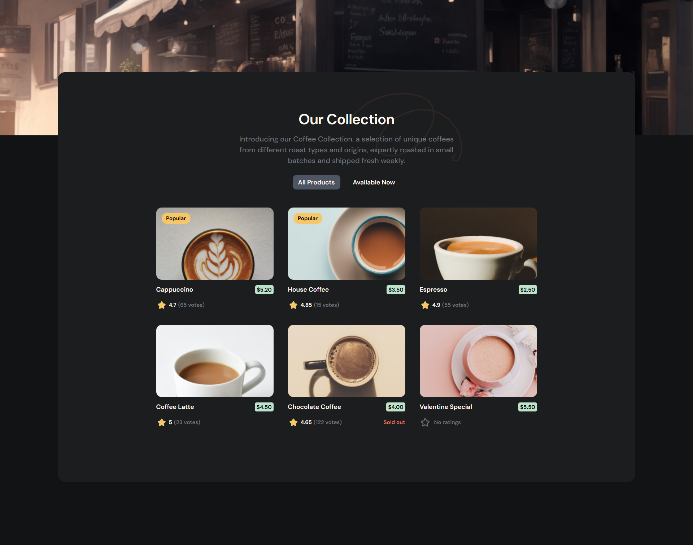

<h1 align="center">Simple Coffee Listing Master | devChallenges</h1>

   Solution for a challenge <a href="https://devchallenges.io/challenge/simple-coffee-listing" target="_blank">Simple Coffee Listing</a> from <a href="http://devchallenges.io" target="_blank">devChallenges.io</a>.

  <h3>
    <a href="https://simple-coffee-listing-master.netlify.app/">
      Demo
    </a>
     | 
    <a href="https://github.com/prottoymankin/simple-coffee-listing-master">
      Solution
    </a>
     | 
    <a href="https://devchallenges.io/challenge/simple-coffee-listing">
      Challenge
    </a>
  </h3>

## Table of Contents

- [Overview](#overview)
  - [What I learned](#what-i-learned)
  - [Useful resources](#useful-resources)
- [Built with](#built-with)
- [Features](#features)
- [Contact](#contact)
- [Acknowledgements](#acknowledgements)

## Overview

### What I learned

I have experience in creating reusable and scalable components to maintain clean and efficient code. How to use component library daisy ui.
I can fetch data from APIs and dynamically display it in a structured way.
Additionally, I use Tailwind CSS to build fully responsive and visually appealing user interfaces.

### Useful resources

- React Documentation – https://react.dev  
- Tailwind CSS Docs – https://tailwindcss.com  

### Built with

- Semantic HTML5 markup
- Flexbox
- CSS Grid
- [React](https://reactjs.org/)
- [Tailwind](https://tailwindcss.com/)
- Daisy UI

## Features

- Dynamic product listing  
- Filter by availability  
- Responsive design  
- Clean and modern UI  

## Contact

- GitHub: https://github.com/prottoymankin/ 
- Email: prottoy032020@gmail.com 

## Acknowledgements

- DevChallenges for the project idea

## Author

- GitHub [@prottoymankin](https://github.com/prottoymankin/)
